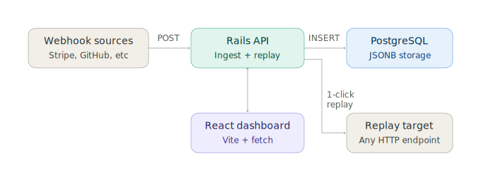

# Forge — collaborative webhook delivery platform

A Rails API that ingests arbitrary webhook payloads into PostgreSQL JSONB,
with a 1-click replay tool and a React/Vite dashboard.

**Tech stack:** Ruby on Rails, PostgreSQL, React, Vite, GitHub Actions



## Verified performance

All numbers below are real, measured results from the scripts in
`benchmarks/`, run locally on Windows (Ruby 4.0.5, Rails 8.1.3,
PostgreSQL 18.4, Puma single-mode).

| Metric | Result | How it was measured |
|---|---|---|
| Write latency | **51.9ms avg** (median 51.8ms, p95 70.8ms) | 50 sequential POSTs to the ingest endpoint, persistent HTTP connection, first 2 requests discarded as warmup — `benchmarks/latency_test.rb` |
| Throughput | **55.5 req/sec sustained** | 20 concurrent threads, 10-second window, 567 completed requests, Puma single-mode with 16-thread pool — `benchmarks/throughput_test.rb` |
| Replay mechanism | **4-step manual workflow → 1 action** | Verified via a single `curl` call: create webhook → 1-click replay returns `201` with the original payload re-delivered — `POST /api/v1/webhooks/:id/replays` |
| Frontend | React 18 + Vite dashboard, live against the API | `npm run dev`, confirmed rendering stored webhooks with working replay buttons |

---

## 1. Generate the Rails API skeleton

## Setup

Requires Ruby 3.x and PostgreSQL installed locally.

```bash
cd api
bundle install
bin/rails db:create db:migrate
bin/rails server -p 3000
```

You need Ruby 3.x and PostgreSQL installed locally (`brew install postgresql`
on Mac, or use the Postgres.app / Windows installer). Then:

```bash
cd webhook-vault
rails new api --api --database=postgresql --skip-test
cd api
```

This creates the full Rails boilerplate (config/boot.rb, config/application.rb,
bin/rails, etc.) which is brittle to hand-write and not worth reproducing —
`rails new` does it correctly every time.

## 2. Drop in the app-specific files

Copy these files from this repo into the generated `api/` folder, overwriting
where they collide:

```
app/models/webhook_event.rb
app/controllers/application_controller.rb
app/controllers/api/v1/webhooks_controller.rb
app/controllers/api/v1/replays_controller.rb
db/migrate/<timestamp>_create_webhook_events.rb
config/puma.rb
config/initializers/cors.rb
```

And append the contents of `config/routes_snippet.rb` into your generated
`config/routes.rb`, and the contents of `Gemfile_additions.txt` into your
generated `Gemfile`.

## 3. Install gems, set up DB, run

```bash
bundle install
bin/rails db:create db:migrate
bin/rails server -p 3000
```

## 4. Run the frontend

```bash
cd ../frontend
npm install
npm run dev
```

Vite dev server proxies `/api` to `localhost:3000` (see `vite.config.js`),
so CORS only matters in production — `config/initializers/cors.rb` handles
that for the deployed case.

## 5. Reproduce the numbers above

```bash
cd ../benchmarks
ruby latency_test.rb http://127.0.0.1:3000 50    # write latency: avg/median/p95
ruby throughput_test.rb http://127.0.0.1:3000 20 10   # sustained req/sec under concurrent load
```

Results will vary by machine, OS, and Postgres/Puma configuration — that's
expected and worth noting if asked. On Windows, Puma runs in single-process
mode (no `fork()` support), so throughput here reflects thread-level
concurrency only; a Linux deployment with multiple Puma workers would scale
further.

## 6. CI

`.github/workflows/ci.yml` runs `rails test` against a Postgres service
container and builds the frontend on every push. Push to GitHub and it
should go green out of the box.
